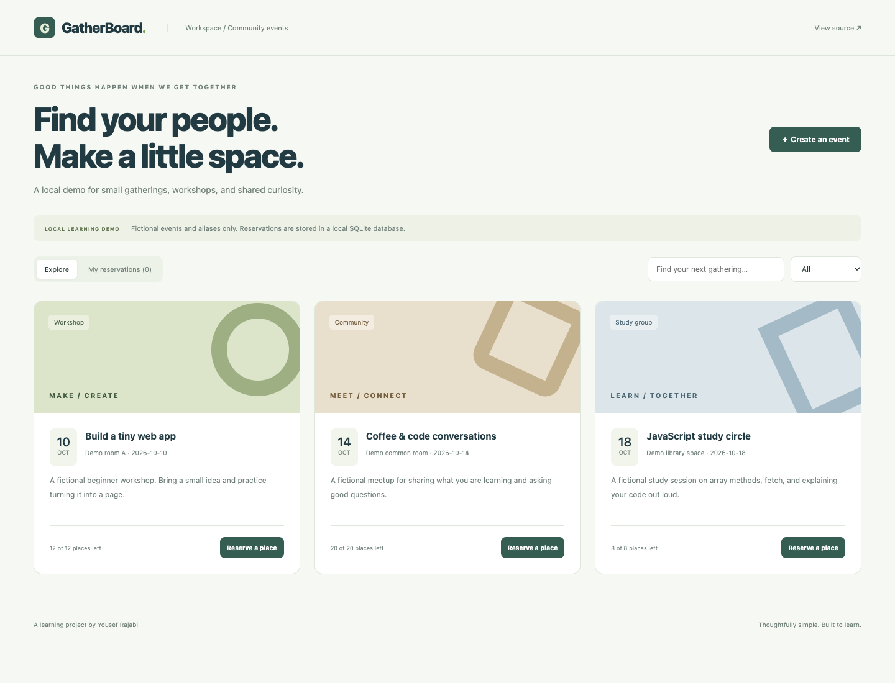

# GatherBoard

A small full-stack learning app for fictional events and local seat reservations.

**A junior-level, AI-assisted portfolio learning project by Yousef Rajabi.**

## Screenshot



[Mobile screenshot](docs/screenshots/mobile.png) · [Learning guide](docs/LEARNING.md) · [Checks](https://github.com/yousefrajabi06-debug/gatherboard/actions)

Screenshots show the running application with fictional sample data. They are not design mockups.

## Live Demo

[Open GatherBoard](https://yousef-gatherboard.netlify.app/)

This hosted preview uses fictional browser-local data. To run the Express API and SQLite database, follow Installation below. It has no hosted accounts or shared reservations.

## Why this project

Adds a real HTTP API and relational storage as a manageable next step beyond frontend-only localStorage projects.

## Features

- Browse and filter fictional workshops, community events, and study groups.
- Create an event with server-validated date, category, and capacity.
- Reserve a place using a fictional alias and cancel a saved reservation.
- Store events and reservations in SQLite with foreign keys and uniqueness constraints.
- Use parameterized SQL and a transaction around the capacity check and insert.
- Show loading, API failures, retry controls, empty views, and submission progress.

## Tech Stack

React 19, JavaScript, Express 5, Node.js 24 built-in SQLite, Vite, CSS, node:test, Playwright.

## Installation

Use **Node.js 24+** and npm. Install dependencies from the project directory:

```bash
git clone https://github.com/yousefrajabi06-debug/gatherboard.git
cd gatherboard
npm install
npm run dev
```

Open http://127.0.0.1:5173. The same command starts the Express API at http://127.0.0.1:3001. Keep both ports free. No API credentials or environment file are needed. Node 24 is required for built-in SQLite. The database is created automatically in `server/data/gatherboard.sqlite` and is gitignored. To reset only this local demo, stop the app, remove that generated database, restart, and clear the browser reservation references.

No secret API keys are required. Never put credentials in frontend code. Dependencies are locked in `package-lock.json`; use `npm ci` for a reproducible clean install.

## Production build

```bash
npm run build
npm start
```

The built frontend is served by Express at http://127.0.0.1:3001. This remains a local demo, not a public deployment.

## Tests

```bash
npx playwright install chromium
npm test
```

If Chrome is already installed locally, macOS/Linux users can instead run `PLAYWRIGHT_CHANNEL=chrome npm test`. Browser tests use local development servers. GitHub Actions performs `npm ci`, builds the project, installs Chromium, and runs the tests on pushes and pull requests.

Six server tests cover invalid input, concurrent capacity, cancellation, duplicate aliases, parameterized SQL, malformed JSON, and browser origins. Three browser tests cover creation/reservation/persistence/cancellation, retry behavior, search, and mobile layout.

## Source organization

- [`src/App.jsx`](src/App.jsx): API-backed event, reservation, form, and loading states.
- [`src/lib/api.js`](src/lib/api.js): JSON requests, a timeout, and readable error handling.
- [`src/components/EventForm.jsx`](src/components/EventForm.jsx): Beginner-friendly controlled event form.
- [`server/app.js`](server/app.js): HTTP routes, validation, parameterized SQL, and reservation transaction.
- [`server/database.js`](server/database.js): Tables, constraints, and fictional seed records.
- [`server/index.js`](server/index.js): Loopback-only server, generated database folder, and production static files.
- [`server/app.test.js`](server/app.test.js): Capacity, duplicate aliases, cancellation, validation, SQL, and origin checks.
- [`tests/app.spec.js`](tests/app.spec.js): Browser create/reserve/reload/cancel flow and error/mobile states.

## What I Learned

This AI-assisted implementation provides practice with the following concepts. These are study outcomes to work through, not a claim that every line was written independently:

- Follow one reservation from the form through fetch, Express, SQL, and the response.
- Explain why the server validates data even when the form already validates it.
- Understand a foreign key, a unique constraint, and parameterized SQL.
- Explain why checking capacity and inserting a reservation belong in one transaction.
- Compare browser reservation references with the database as the source of truth.

See [the learning guide](docs/LEARNING.md) for an independent feature exercise and a rebuild plan.

## Limitations and data

LOCAL LEARNING DEMO ONLY. There is no authentication or authorization model. Anyone with local access can create events; a reservation ID acts as a cancellation capability. Use fictional aliases, not real attendee details. The server binds only to 127.0.0.1. Do not expose it publicly without adding authentication, ownership, rate limiting, and an appropriate data-handling design. Clearing localStorage loses cancellation references; resetting the SQLite database makes saved references stale.

The responsive UI includes visible keyboard focus and labeled controls. Browser tests are useful regression checks; they are not a complete accessibility audit. No private personal data, real credentials, generated databases, or `.env` files are committed. External Google Fonts are optional cosmetic requests; system font fallbacks keep the interface usable if fonts are unavailable.

## Future Improvements

- Learn authentication and event ownership before considering a public deployment.
- Handle stale local reservation references after a database reset.
- Add event editing/cancellation with ownership and validation.

## Authorship and AI assistance

Created for Yousef Rajabi's student portfolio with AI assistance in planning, implementation, testing, and documentation. Original project code was built for this portfolio; it was not copied from another GitHub application. Third-party libraries remain credited through the Tech Stack and dependency files. This is learning work, not paid client work or invented professional experience.

## Netlify browser preview

Netlify builds with `npm run build:demo`. This mode uses `src/lib/demo.js` and localStorage, not Express or a hosted SQLite database. A visible banner explains that bookings are fictional, private to one browser, and not shared with other visitors. The original full-stack app still runs with `npm run dev` or `npm run build && npm start`. Clearing site data resets the preview. Browser storage is not encrypted, and concurrent edits in multiple tabs are not supported. Four additional Node tests cover demo persistence, capacity, duplicate aliases, invalid dates, and storage failures.
